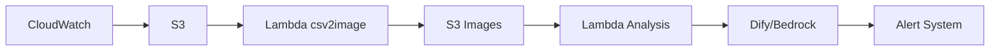

# BedrockWatch

<p align="center">
  <a href="LICENSE"></a>
  <a href="#"></a>
  <a href="#"></a>
  <a href="#"></a>
</p>

## 📖 简介

BedrockWatch 是一个基于 AWS Bedrock Claude 3.5 和 Dify 构建的智能监控预警系统。它能够实时分析系统指标，提供精准的异常检测和智能告警，帮助运维团队快速发现和解决问题。

## ✨ 核心特性

- 🎯 超高准确度 - 基于 Claude 3.5 的智能分析，准确识别异常
- ⚡️ 快速响应 - 1分钟内完成分析和告警
- 🤖 全自动化 - 从数据采集到告警推送全流程自动化
- 📊 精准覆盖 - 智能过滤告警疲劳，确保重要告警不遗漏
- 🎨 高度可定制 - 灵活的规则配置，适应不同场景需求
- 🔮 预测性告警 - 提前预测潜在问题，防患于未然
- ⚙️ 高采样分析 - 支持高频数据采样和实时分析

## 🏗️ 系统架构

## 🛠 架构设计



### 核心组件

- **数据采集层**
  - AWS CloudWatch
  - Prometheus

- **数据处理层**
  - S3 存储
  - Lambda 函数集群
  - SQS 消息队列

- **智能分析层**
  - Dify 应用服务
  - AWS Bedrock Claude 3.5
  - 自定义分析引擎

- **告警输出层**
  - Lark 机器人
  - 告警管理平台

## 🚀 快速开始

### 前置要求

- AWS 账号及相关服务权限
- Dify 账号和 API Token
- Python 3.8+
- Docker (可选)

### 部署步骤

1. **克隆代码仓库**
```bash
git clone https://github.com/your-username/BedrockWatch.git
cd BedrockWatch
```

## 💡 使用建议

### 成本优化
- 监控指标数据处理后转化为图片，在提升准确度的同时降低成本
- Claude 3.5 识别单个服务 8 小时监控指标图消耗约 2800 tokens
- 单次图片识别成本约 $0.0157
- 日均成本估算：300张 * 2次 * $0.0157 ≈ $10/天

### 监控优化
- 采用 8 小时作为监控窗口最佳，可避免遗漏异常点
- 建议提前预处理监控数据，例如屏蔽重启等已知异常时间点
- 通过调整提示词改变准确度和规则，避免过度告警

### 效率提升
- 使用 RAG 技术快速定位历史问题，便于排查和自助修复
- 支持批量服务指标分析
- 告警自动分类和优先级排序
